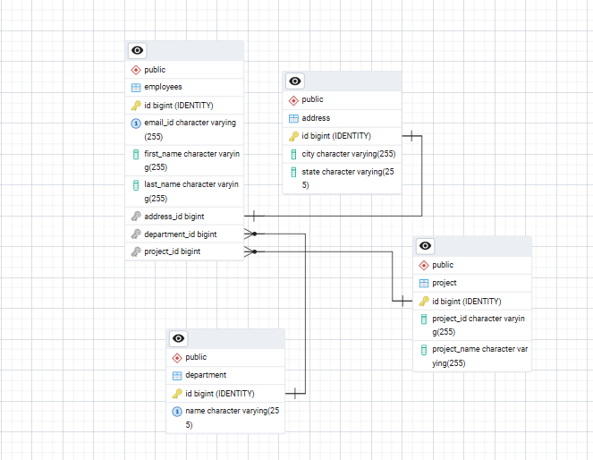

# 🏢 OfficeAxis – Employee Management FullStack Website

**OfficeAxis** is a full-stack **Employee Management System** that helps manage employees and departments with a clean and responsive UI.

---

## 🛠️ Tech Stack

- **Frontend**: React.js (Vite)  
- **Backend**: Spring Boot (RESTful API)  
- **Database**: PostgreSQL (Neon.tech)  
- **Deployment**:  
  - Netlify (Frontend)  
  - Render (Backend)  
  - Neon (Database)  
  - Docker (Backend Image)  

---

## 📸 Features

- ✅ Add a new employee  
- ✅ Add new departments  
- ✅ View all employees  
- ✅ Update employee information  
- ✅ Assign department to employee  
- ✅ Delete an employee  
- ✅ Clean UI with responsive design  

---
## 📊 ERD (Entity Relationship Diagram)



## 📁 Project Structure

📦 **officeaxis**  
***├── backend (Spring Boot App)***  
│ ├── src/main/java/com/officeaxis<br>
│ │ ├── controller/<br>
│ │ ├── dto/<br>
│ │ ├── entity/<br>
│ │ ├── mapper/<br>
│ │ ├── repository/<br>
│ │ ├── service/<br>
│ │ ├── service/impl/<br>
│ └── .env (Db URL, username, password, frontend URL)<br>

***├── frontend (React + Vite App)***  
│ ├── src/<br>
│ │ ├── components/<br>
│ │ ├── containers/<br>
│ │ ├── assets/<br>
│ │ ├── services/<br>
│ │ ├── pages/<br>
│ └── .env (`VITE_API_BASE_URL`)<br>

---

## ⚙️ Backend Setup (Spring Boot)

### Prerequisites
- Java 17 or 21  
- Maven  
- PostgreSQL  

### Steps to Run

```bash
cd backend
./mvnw install 
./mvnw spring-boot:run
```
## ⚙️ FrontEnd Setup (React + Vite App)

### Prerequisites
- Node.js
- npm or yarn
  
### Steps to Run

```bash
cd ems-frontend
npm install
npm run dev
```
